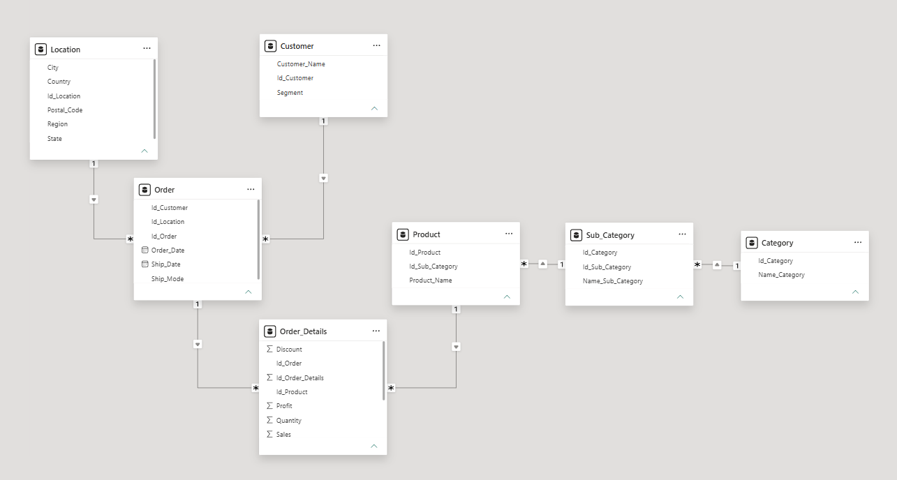

# Análisis de Rentabilidad — Superstore

## 1. Contexto y Objetivo

La cadena minorista SuperStore (EE. UU.) presentaba un desafío comercial: durante los últimos años, el crecimiento de sus ganancias se estancó, sin acompañar el ritmo de incremento de sus ventas. Para diagnosticar la causa raíz de esta brecha financiera, se definieron los siguientes objetivos analíticos:

- Identificar las categorías y subcategorías de productos con alto volumen de ventas, pero con márgenes de ganancia bajos o negativos.
- Analizar la variación del desempeño comercial y la rentabilidad en las distintas regiones
- Evaluar el impacto de la estrategia de descuentos sobre la rentabilidad neta del negocio.

**Herramientas:** SQL Server, Power BI
**Fuente de datos:** [Superstore Dataset](https://www.kaggle.com/datasets/vivek468/superstore-dataset-final) (Kaggle)

## 2. Modelado de Datos

El dataset se importó inicialmente a un área de Staging (tabla plana) en SQL Server y, posteriormente, se normalizó estructurando la información en 7 tablas relacionales. Durante el modelado de datos se tomaron decisiones técnicas clave: se implementó un `Product_ID` autogenerado, dado que el identificador original carecía de consistencia y unicidad para ser utilizado como llave primaria (PK). Además, el análisis de dependencias reveló que la entidad `Location` dependía directamente de `Order` y no de `Customer`, al evidenciarse que un mismo cliente podía registrar pedidos desde múltiples ubicaciones.

## 3. Proceso de Carga (ETL)

Durante la fase de ingesta de datos, se presentó un desafío con el comando `BULK INSERT`, el cual generaba errores al analizar (parsear) campos de texto que contenían comillas. Para solucionarlo, se optó por utilizar el SQL Server Import and Export Wizard, dado que su motor de procesamiento de archivos CSV gestiona de manera más eficiente los delimitadores complejos, como comas y comillas internas. Asimismo, como parte del proceso de limpieza de calidad de datos (Data Cleaning), se identificó y excluyó un registro que contenía un valor nulo en el campo `Profit` para garantizar la exactitud en los cálculos de rentabilidad.

## 4. Consultas de Análisis Clave

El detalle completo de las consultas se encuentra en [`sql/03_consultas_analisis.sql`](sql/03_consultas_analisis.sql). Estas responden a las siguientes preguntas de negocio:

- ¿Cuál es el volumen de ingresos y la rentabilidad que aporta cada categoría al negocio?
- ¿Qué subcategorías presentan un margen de ganancia negativo o deficiente?
- ¿En qué subcategorías los descuentos aplicados impactan más negativamente sobre las ganancias?
- ¿Existe una relación entre el precio unitario de los productos y las pérdidas generadas en ciertas subcategorías?

## 5. Hallazgo y Recomendación Final

##  Hallazgos Clave

El análisis de rentabilidad reveló dos patrones de pérdida financiera completamente distintos:

*   **Erosión por descuentos en *High-Ticket*:** Subcategorías con un alto precio promedio por unidad, como **Tables** (~$167) y **Bookcases** (~$132), sufren grandes pérdidas netas debido a la aplicación de descuentos agresivos (superiores al 20%).
*   **Anomalía de Margen:** La subcategoría **Supplies** representa una excepción crítica. A pesar de mantener un precio promedio moderado (~$72) y el porcentaje de descuento más bajo de todo el portafolio (~7.6%), genera pérdidas. Esto indica que el problema subyacente no es la política promocional, sino márgenes de rentabilidad estructuralmente deficientes.

---

##  Recomendaciones Estratégicas

*   **Para los productos de alto valor:** Establecer umbrales estrictos de descuento para proteger el margen bruto en categorías clave como muebles.
*   **Para el caso *Supplies*:** Se requiere una auditoría profunda sobre su estructura de costos (proveedores, envíos, manufactura) para determinar por qué un producto con casi nulo descuento opera a pérdida. Con esto se evaluará si es viable mantener la categoría o si requiere una renegociación con proveedores.
